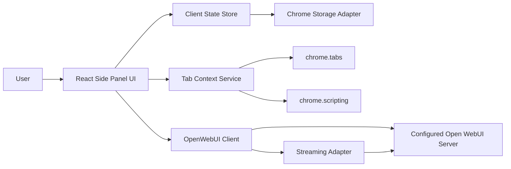

# Open WebUI Chrome Extension Technical Design

## Purpose

This document translates the MVP PRD into an implementation design for a Chrome Manifest V3 extension. The goal is to build a native side-panel Open WebUI client, not an iframe wrapper and not a generic OpenAI-compatible chat client.

The design borrows the key lesson from Open Relay: high Open WebUI parity requires a dedicated Open WebUI compatibility layer that mirrors the web client's request lifecycle.

## Technical Verdict

The MVP is technically feasible.

The high-risk areas are not Chrome extension basics. They are Open WebUI compatibility details:

- the exact chat history shape Open WebUI expects
- tool and function discovery
- model-specific defaults and capabilities
- request payload fields needed for tool execution and server-side history
- streaming behavior for normal models versus pipe/function models
- post-completion processing through `/api/chat/completed`

Chrome-specific tab features are also feasible, with a clear limitation: listing tabs is straightforward, but readable page text from non-active tabs is permission-dependent.

## Architecture



The extension should be split into small modules:

- `OpenWebUIClient`: all server API calls and request payload compatibility
- `StorageService`: typed wrapper around `chrome.storage.local`
- `PermissionsService`: optional host permission requests for the configured server
- `TabContextService`: open-tab listing and selected-tab text extraction
- `ChatRuntime`: orchestration for new chat, continue chat, stream, finalize, recover
- `ModelRuntime`: model list, full model config, default feature/tool state
- `ToolsRuntime`: tools/functions discovery and selection state
- `SidePanelApp`: React UI composition

## Chrome Extension Structure

Recommended initial structure:

```text
public/
  manifest.json
src/
  background/
    serviceWorker.ts
  sidepanel/
    index.html
    main.tsx
    App.tsx
    routes/
    components/
  content/
    extractPageContext.ts
  lib/
    openwebui/
      client.ts
      types.ts
      requestBuilders.ts
      stream.ts
    chrome/
      storage.ts
      permissions.ts
      tabs.ts
    runtime/
      chatRuntime.ts
      modelRuntime.ts
      toolsRuntime.ts
    ui/
      markdown.ts
      errors.ts
```

The side panel owns most UI state. The service worker should stay thin:

- open side panel on extension action click
- handle any Chrome APIs that are easier or required in an extension context
- avoid keeping critical chat state only in the service worker because MV3 workers can suspend

## Manifest

MVP permissions:

```json
{
  "manifest_version": 3,
  "permissions": [
    "sidePanel",
    "storage",
    "activeTab",
    "scripting",
    "tabs"
  ],
  "optional_host_permissions": [
    "http://*/*",
    "https://*/*"
  ],
  "background": {
    "service_worker": "background/serviceWorker.js",
    "type": "module"
  },
  "side_panel": {
    "default_path": "sidepanel/index.html"
  },
  "action": {
    "default_title": "Open WebUI"
  }
}
```

Implementation rule:

- request optional host permission only for the configured Open WebUI server origin
- do not request broad page-content permissions for MVP
- use `activeTab` and explicit user action for page text capture

## Local Storage

Use a typed wrapper around `chrome.storage.local`.

Suggested persisted shape:

```ts
type ExtensionStorage = {
  serversById: Record<string, ServerRecord>;
  sessionsByServerId: Record<string, SessionRecord>;
  preferencesByServerId: Record<string, ServerPreferences>;
  uiState: {
    activeServerId?: string;
    activeChatId?: string;
  };
};
```

Rules:

- never persist password
- store token only after successful sign-in
- on side-panel startup, read `uiState.activeServerId`, restore the saved server URL, and validate the stored token with `/api/v1/auths/` plus model loading before entering the ready state
- if stored token validation fails or `expiresAt` has passed, keep the saved server URL and known user email available on the login form, but require password re-entry
- provide a forget-saved-server action that removes the server record, session, preferences, and active UI state
- clear token and cached server data on logout or explicit forget
- keep token out of logs, errors, and UI debug output
- do not expose token to content scripts

Chrome does not provide an extension secret vault equivalent to iOS Keychain. `chrome.storage.local` is acceptable for MVP, but the implementation should keep content scripts isolated from auth state.

## Open WebUI API Client

The API client should accept a `serverId`, `baseUrl`, and token provider. It should normalize base URLs, attach `Authorization: Bearer <token>`, and surface typed errors.

### Auth

Local login:

```http
POST /api/v1/auths/signin
Content-Type: application/json

{
  "email": "user@example.com",
  "password": "..."
}
```

After receiving a token:

```http
GET /api/v1/auths/
Authorization: Bearer <token>
```

Reason: Open Relay fetches the full current user after login because sign-in response may not include full permissions.

### Config Probe

After the user enters a server URL, perform a compatibility probe:

1. normalize URL
2. request optional host permission for the origin
3. fetch `/api/config`
4. verify it looks like Open WebUI
5. login
6. fetch `/api/v1/auths/`
7. fetch models

The probe should distinguish unreachable server, non-Open-WebUI server, auth failure, and permission failure.

### Models

Use two model fetch paths:

- `GET /api/models` for the general model list
- `GET /api/v1/models/model?id=<modelId>` for full selected-model metadata

The full model config is needed for:

- `params.function_calling`
- `meta.capabilities`
- `meta.builtinTools`
- `meta.toolIds`
- `meta.defaultFeatureIds`
- full `model_item` payload used by some Open WebUI routing paths

Do not rely only on `/api/models` for tool decisions.

### Chats

Minimum endpoints:

- `GET /api/v1/chats/?include_folders=false&include_pinned=true`
- `GET /api/v1/chats/pinned`
- `GET /api/v1/chats/:id`
- `POST /api/v1/chats/new`
- `POST /api/v1/chats/:id`

Active chat behavior:

- create a server-side chat only for the first message without an active chat, or after the user explicitly chooses "New chat"
- keep the active chat id in side-panel state while the conversation remains selected
- append follow-up user and assistant nodes to the existing chat tree with `POST /api/v1/chats/:id` before generating
- allow the selected model to change inside the active chat; the next completion uses the newly selected model while preserving the same chat id and message tree

Recent menu:

- use the first page of `/api/v1/chats/`
- merge pinned status if available
- show truncated titles
- highlight active chat

Full history:

- page through `/api/v1/chats/?page=N&include_folders=false&include_pinned=true`
- stop when an empty page or compatible end signal is returned

### Chat History Shape

Open WebUI stores chats as a message tree, not merely a flat list. The implementation should preserve:

- node ids
- `parentId`
- `childrenIds`
- selected branch/current message path
- assistant message id
- user message node

MVP can start with simple linear chats, but the API layer should already model ids and parent-child relationships so branch support does not require a rewrite.

Before generation, sync the current chat tree to the server. New chats should create the initial user and assistant placeholder nodes. Follow-up messages should update the existing chat tree by appending a new user node under the current assistant node, then appending a new assistant placeholder under that user node. During generation, include `chat_id`, the new assistant `id`, `parent_id`, and `user_message` in the chat completion request so newer Open WebUI servers can insert the user message correctly.

## Chat Completion Request

Build a request object that mirrors Open WebUI, not plain OpenAI.

Canonical request fields:

```ts
type ChatCompletionRequest = {
  stream: true;
  model: string;
  messages: Array<Record<string, unknown>>;
  chat_id?: string;
  session_id?: string;
  id?: string;
  parent_id?: string | null;
  user_message?: Record<string, unknown>;
  model_item?: Record<string, unknown>;
  tool_ids?: string[];
  filter_ids?: string[];
  features: {
    web_search: boolean;
    image_generation: boolean;
    code_interpreter: boolean;
    memory: boolean;
  };
  params: Record<string, unknown>;
  variables: Record<string, unknown>;
  metadata: {
    variables: Record<string, unknown>;
  };
  stream_options: {
    include_usage: true;
  };
  background_tasks: Record<string, unknown>;
  tool_servers: Array<Record<string, unknown>>;
};
```

Important compatibility rules:

- always send explicit `features` booleans, including `false`
- include `stream_options.include_usage`
- include `params` and `variables` even when empty if the server path expects Open WebUI web-client shape
- include `model_item` when available
- include `user_message` when sending a user prompt into a server-side chat
- include `tool_ids` only when selected tools exist
- include `filter_ids` from model/global filter resolution

### Pipe/Function Models

Open Relay treats pipe/function models specially. For pipe models:

- omit `session_id`, `chat_id`, and `id` together from the completion request
- stream directly from the HTTP response body when supported
- keep `params`, `background_tasks`, `tool_servers`, `variables`, and `model_item` shape consistent

This should be implemented behind a `buildCompletionPayload()` function so UI code does not need to know these rules.

## Streaming Strategy

There are three viable streaming paths:

1. Socket.IO web-client-compatible path
2. direct SSE for pipe/function models or compatible servers
3. HTTP submit plus polling chat state as fallback

Recommended MVP order:

1. Validate direct `fetch()` streaming against `/api/chat/completions` with the target server.
2. Implement direct `fetch()` streaming if validation returns usable incremental output.
3. Implement pipe-model special-case payload behavior.
4. Implement polling recovery by refetching `/api/v1/chats/:id` while a response is active.
5. Add Socket.IO if direct streaming does not deliver normal-model output, tool status updates, or server-side parity on the target server.

Why not Socket.IO first:

- it adds dependency and lifecycle complexity inside a side panel
- MV3 service workers can suspend, so the side panel should own active stream state
- direct fetch streaming may be enough for many Open WebUI paths, but this must be proven against the target server before relying on it

Why keep polling recovery in MVP:

- tools can run for a long time
- server-side content may update even if token streaming is interrupted
- Open Relay uses polling to recover from socket failures and tool delays

### Stream Handling

The stream adapter should parse:

- standard SSE `data:` lines
- `[DONE]`
- OpenAI-style `choices[].delta.content`
- usage chunks when present
- JSON events with status/source/error data if returned by Open WebUI

The UI should support:

- incremental assistant text
- structured status updates
- source/citation metadata when safely available
- error attached to the active assistant message
- stop/cancel if task id is available

## Chat Finalization

After a response finishes:

1. mark local assistant message as no longer streaming
2. call `/api/chat/completed`
3. refetch the server-side chat
4. merge any post-processed message content, files, status, usage, title, or metadata
5. refresh recent chats

Reason: Open WebUI filters, outlets, usage tracking, tool outputs, title generation, and follow-up tasks may happen after the main stream.

## Tools And Functions

The MVP tools system should match Open WebUI server-side behavior.

Discovery sources:

- `GET /api/v1/tools/list` for normal workspace tools, with `GET /api/v1/tools/` as a compatibility fallback if needed
- `GET /api/v1/functions/` for action/filter functions
- selected model full config for model-assigned tool ids, default features, capabilities, and function-calling mode

Tool state sources:

- user-selected `tool_ids`
- built-in `features`
- model default feature ids
- model capabilities
- global active tools
- filter ids

The API client should normalize tool/function records into a shared UI shape:

```ts
type ToolMenuItem = {
  id: string;
  name: string;
  description?: string;
  kind: "tool" | "filter" | "builtin";
  isGlobal?: boolean;
  isActive?: boolean;
  isEnabledByDefault?: boolean;
};
```

For toggle-filter functions, include only active filters that are explicitly toggleable in metadata. These appear beside tools in the menu but are sent as `filter_ids`, not `tool_ids`.

Built-in feature toggles:

- web search
- image generation
- code interpreter
- memory

Rules:

- server/model/user availability controls whether a toggle appears
- switching model resets defaults to that model
- manual user toggles must not be overwritten before send
- globally enabled tools should appear selected by default unless user disabled them
- model-assigned tools should appear selected by default unless user disabled them
- selected custom tools are sent as `tool_ids`
- enabled built-in tools are sent in `features`
- active filter functions are sent as `filter_ids`

MVP rendering:

- markdown
- code blocks
- links
- status/progress rows
- source snippets if provided

Follow-up rendering:

- rich HTML artifacts
- SVG previews
- Mermaid diagrams
- audio/video outputs
- custom artifact viewers

## Selected Tab Context

The browser context feature is independent from Open WebUI tools. It is client-side prompt augmentation.

### Tab Listing

Use `chrome.tabs.query({ currentWindow: true })` first for MVP. Later, consider all windows if useful.

Display:

- favicon
- title
- URL/origin
- current tab label
- selected state

### Text Extraction

For the active/current tab:

- use `chrome.scripting.executeScript`
- inject a small extraction function
- capture selected text via `window.getSelection()?.toString()`
- capture readable text using a conservative DOM text extraction

For non-active selected tabs:

- title and URL are reliable with `tabs`
- readable text may fail without host permission or activation
- if text extraction fails, attach title/URL and show "page text unavailable"

### Prompt Injection

Inject selected tab context as visible context blocks before the user's prompt:

```text
Context from selected browser tabs:

Tab 1
Title: ...
URL: ...
Selected text:
...
Readable page text:
...

User prompt:
...
```

Limits:

- cap readable text at 20,000 characters per selected tab
- mark truncation visibly in the prompt block
- do not log captured page content

## UI State Machine

High-level states:

```text
unconfigured
configuredUnauthenticated
authenticating
authenticatedLoading
ready
streaming
errorRecoverable
errorAuthExpired
```

Primary views:

- connection/login view
- chat welcome view
- active chat view
- recent chats popover
- full history view
- tools popover
- add-tabs popover
- settings/account view

The side panel should keep a single active chat runtime. If the user switches chat during streaming, the app should either prevent switching or explicitly stop/detach the active stream. For MVP, prefer preventing chat switches during an active stream unless the user stops generation.

The side panel should expose an explicit "New chat" action. Changing the selected model must not clear `activeChatId` or local transcript state. Only the "New chat" action, logout, reconnect, or selecting a different server-side chat should replace or clear the active chat.

## Error Handling

Typed errors should flow from low-level modules to UI messages.

Error categories:

- `ServerPermissionError`
- `ServerUnreachableError`
- `NotOpenWebUIError`
- `AuthFailedError`
- `TokenExpiredError`
- `ModelUnavailableError`
- `ToolUnavailableError`
- `StreamInterruptedError`
- `ChatSyncError`
- `TabContextUnavailableError`
- `RestrictedPageError`

Important behavior:

- token expired should route to login
- tool unavailable should keep chat usable
- tab context unavailable should remove that tab's text but keep title/URL when possible
- stream interrupted should offer retry and refresh from server chat
- chat finalization failure should warn but not discard local visible response

## Proof-Of-Concept Gates

Before building the full UI, validate these with a small API harness:

1. Login with server URL, email, and password.
2. Fetch current user.
3. Fetch model list.
4. Fetch full model config for the selected model.
5. Fetch recent chats.
6. Create a new chat.
7. Send one streaming message and confirm incremental output arrives through direct fetch streaming or polling recovery.
8. Finalize with `/api/chat/completed`.
9. Refetch chat and confirm message persisted.
10. Send a second message and confirm it updates the same chat id instead of creating a new chat.
11. Switch model and send another message, confirming the same chat id is preserved.
12. Use the explicit "New chat" action and confirm the next send creates a separate chat id.
13. Fetch tools/functions.
14. Send a message with one selected tool and explicit `features`.
15. Confirm whether selected-tool status/output arrives through direct streaming, polling, or requires Socket.IO.
16. Verify open-tab listing in Chrome.
17. Verify active-tab readable text extraction.
18. Verify graceful fallback for a non-readable tab.

Do not polish chat UI until gates 1-15 pass against the target Open WebUI server. Do not polish tab-context UI until gates 16-18 pass in Chrome.

## Implementation Order

1. Project scaffold: Vite, React, TypeScript, MV3 side panel.
2. Typed storage service and basic settings state.
3. Manifest, action click, side panel open behavior.
4. Server URL form and optional host permission request.
5. Open WebUI auth client and current-user fetch.
6. Model list and full selected-model config.
7. Chat list, recent chats, full history paging.
8. Chat data model with message ids and simple parent-child tracking.
9. Explicit new chat, active-chat continuation, and direct streaming message.
10. `/api/chat/completed` finalization and server refetch.
11. Tools/functions discovery.
12. Tool/default feature selection logic.
13. Completion payload builder for Open WebUI compatibility.
14. Pipe/function model request handling.
15. Polling recovery for interrupted streams or long-running tools.
16. Add-tabs picker.
17. Active-tab text extraction and selected-tab prompt injection.
18. Gemini-like UI polish.
19. Manual end-to-end test pass.

## Testing Strategy

Unit tests:

- URL normalization
- storage migrations
- payload builders
- feature/tool default merging
- SSE parser
- tab context truncation
- error mapping

Integration tests with mocked server:

- login flow
- token expiry
- model list and model config
- chat list and chat detail
- streaming chunks
- chat finalization
- tools payloads

Manual Chrome tests:

- install unpacked extension
- side panel opens
- login against target Open WebUI server
- recent chats menu loads
- model switch updates defaults
- model switch during an active chat keeps the same chat id
- follow-up sends update the same active chat id
- New chat clears the active chat and creates a separate server-side chat on the next send
- built-in tools toggle correctly
- custom tools are sent as `tool_ids`
- active tab context extraction works
- restricted pages fail gracefully
- logout clears session

## Known Trade-Offs

- `chrome.storage.local` is not a true secret vault. It is acceptable for MVP token storage, but we must avoid content-script exposure and logging.
- Full Open WebUI parity may require Socket.IO. Start with fetch streaming plus polling recovery, then add Socket.IO if target-server behavior proves it necessary.
- Non-active tab text extraction cannot be guaranteed without broader host permissions. MVP should list tabs reliably and capture full text where allowed.
- Rich tool artifacts are intentionally out of MVP unless returned as safe markdown/text.
- Branching chat history is modeled early but can be visually simplified in MVP.
